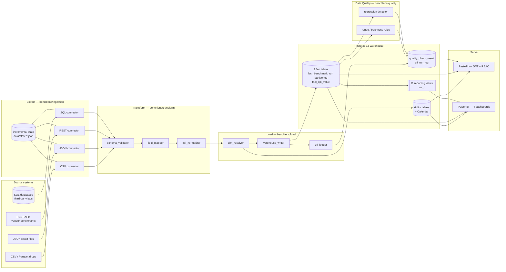
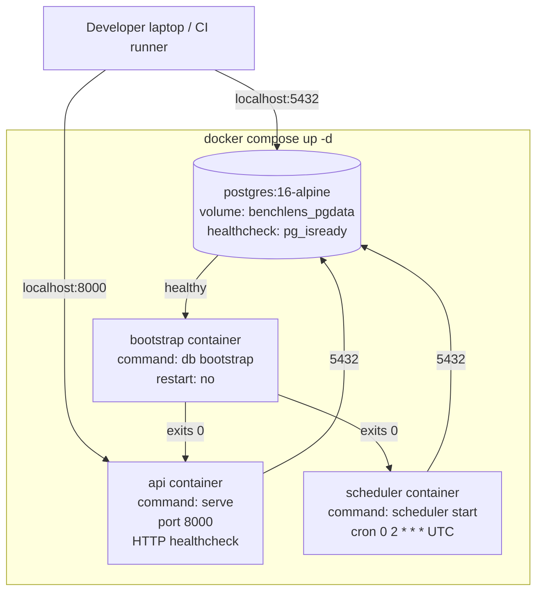

# Architecture

BenchLens is a small, opinionated ELT + serving stack. Everything below the
Power BI layer is plain Python + Postgres — no Spark, no Kafka, no cloud
warehouse. The platform is designed to be runnable end-to-end on a laptop
and to scale to a multi-node Postgres + Power BI Service deployment without
rewrites.

---

## Logical data flow



### Why ELT, not ETL?

Transformations that are **structural** (renaming fields, casting types,
normalizing KPI codes) happen in the Python pipeline so we can fail fast
and quarantine bad records. Transformations that are **analytical** (rollups,
ratios, perf/watt, MTBF, regression baselines) happen in SQL views — they
are deterministic, easy to test in a Postgres console, and naturally
query-fold through Power BI Import mode.

---

## Star schema

```mermaid
erDiagram
    fact_benchmark_run }o--|| dim_workload      : workload_id
    fact_benchmark_run }o--|| dim_hardware      : hardware_id
    fact_benchmark_run }o--|| dim_stack         : stack_id
    fact_benchmark_run }o--|| dim_model         : model_id
    fact_benchmark_run }o--|| dim_date          : run_date_id
    fact_kpi_value     }o--|| fact_benchmark_run: run_id
    fact_kpi_value     }o--|| dim_kpi           : kpi_id
    quality_check_result }o..|| fact_benchmark_run : source_name + source_record_key
```

- **`fact_benchmark_run`** is **monthly-partitioned by `run_date`** (range
  partitioning, 36 partitions pre-created spanning 2025-01 → 2027-12).
  Drop old partitions wholesale instead of slow `DELETE`s.
- **`fact_kpi_value`** holds one row per (run, KPI), so adding a new KPI
  doesn't require a schema change.
- `quality_check_result` joins back to runs via `(source_name,
  source_record_key)` rather than `run_id`, because findings can exist
  before/without a run (e.g. ingest-time freshness check).

Full table/column reference: see `sql/migrations/001_initial_schema.sql`
and the SQLAlchemy models in `benchlens/warehouse/models.py`.

---

## Reporting semantic layer

The platform commits **11 SQL views** as the boundary between operational
data and the BI layer:

| View | Grain | Used by dashboard |
|---|---|---|
| `vw_run_kpi_flat` | (run, KPI) | ad-hoc |
| `vw_run_summary` | run | Executive Summary |
| `vw_hardware_efficiency` | successful run | Hardware Performance |
| `vw_kpi_trend_daily` | (date, workload, hardware, KPI) | all |
| `vw_regression_summary` | finding | Executive, Regression |
| `vw_etl_health` | (date, source, pipeline) | Executive |
| `vw_model_perf_pivot` | (model, workload, hardware, KPI) | Model Comparison |
| `vw_model_comparison_matrix` | model | Model Comparison |
| `vw_run_reliability` | (workload, hardware) cohort | Regression Reliability |
| `vw_regression_trend_daily` | (date, severity, cohort, KPI) | Regression Reliability |
| `vw_regression_detection_lag` | finding | Regression Reliability |

Views are **non-materialized**. Power BI uses Import mode, so each refresh
materializes the result client-side. This trades query-time for refresh-time
and keeps the warehouse simpler.

---

## Runtime topology — docker-compose



Notes:
- `bootstrap` runs `benchlens db bootstrap` once (schema + seeds + views)
  and exits 0. `api` and `scheduler` use `depends_on:
  condition: service_completed_successfully` so they only start after the
  warehouse is ready.
- All three application containers use the **same image** (`benchlens:local`,
  built from [`docker/Dockerfile`](../docker/Dockerfile)); only the
  `command:` differs.

---

## Process model

| Process | Type | Started by | Notes |
|---|---|---|---|
| `benchlens db bootstrap` | one-shot CLI | compose `bootstrap` service or human | Idempotent — re-running is safe |
| `benchlens serve` | long-lived | compose `api` service | Uvicorn + FastAPI, single worker by default |
| `benchlens scheduler start` | long-lived | compose `scheduler` service | APScheduler BackgroundScheduler; one cron job per enabled source |
| `benchlens orchestration run <source>` | one-shot CLI | scheduler or human | Full ETL run for a single source |
| `benchlens reports views refresh` | one-shot CLI | bootstrap, or after schema change | Reapplies 003 + 004 view migrations |

The scheduler does **not** run pipelines in-process — it shells out to the
ingestion+transform+load orchestrator. That means a stuck pipeline can't
freeze the scheduler thread, and you can run the same pipeline ad-hoc from
the CLI.

---

## Security model

- **Auth**: HS256 JWT with stdlib `hashlib.scrypt` for password hashing.
  Token lifetime configurable; defaults to 60 minutes.
- **RBAC**: Two roles, `admin` and `viewer`. Write endpoints (`POST /etl/run`,
  `POST /quality/recheck`, etc.) gate on `require_admin()`. Read endpoints
  gate on `require_viewer_or_admin()`.
- **Demo users**: `admin/admin` and `viewer/viewer` are seeded only when no
  user store is configured. They are **not** created when a real
  `users.yaml` is supplied.
- **Secrets**: `.env` is gitignored; `.env.example` documents required keys.
  `JWT_SECRET` defaults to a development sentinel and must be overridden in
  production (the docker-compose value `please_change_me_local_dev` is a
  loud reminder).
- **Container hardening**: runtime stage runs as non-root user
  `benchlens` (uid 1000); no `pip` or build tools in the runtime image.

---

## Observability

- Structured logs (`logging`) to stdout — captured by Docker.
- ETL runs persist to `etl_run_log` (status, row counts, durations).
- Data-quality results persist to `quality_check_result` with severity rank.
- The reporting view `vw_etl_health` summarizes pipeline reliability by
  day + source for the dashboard tile.

---

## What's intentionally *not* in scope

- **Real-time streaming** — batches only (cron + manual). Adding
  streaming would replace `benchlens/scheduler/` with a Kafka consumer
  but leave the rest untouched.
- **Multi-tenant RLS** — single-tenant by design. Power BI RLS can be
  layered on top of `vw_run_summary` via a `tenant_id` column when needed.
- **Cloud-warehouse-native features** (clustering keys, micro-partitions).
  The platform is built around Postgres semantics; porting to Snowflake or
  BigQuery would require rewriting `warehouse/models.py` and the
  reporting views.
